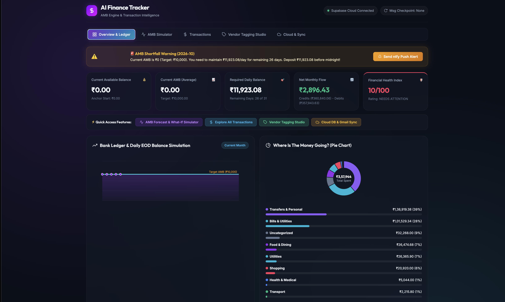
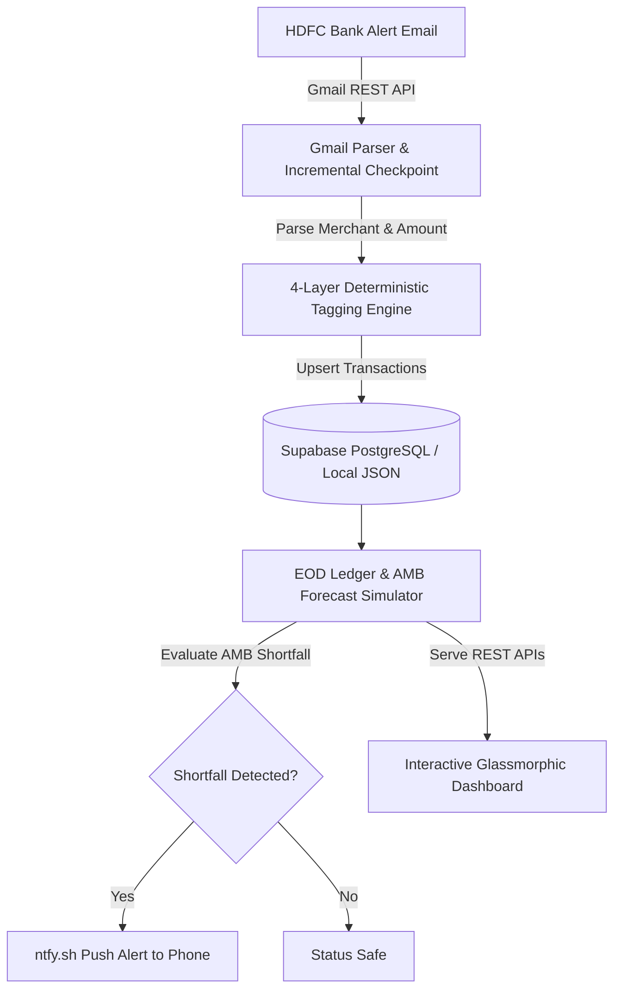

# 🛡️ AI Finance Tracker & AMB Risk Prevention Engine

[](https://www.python.org/)
[](https://supabase.com/)
[](https://github.com/features/actions)
[](LICENSE)

An autonomous, end-to-end personal finance management system that automatically parses bank alert emails via Gmail API, reconstructs daily End-of-Day (EOD) bank ledgers to forecast **Average Monthly Balance (AMB)** shortfall risks, auto-detects recurring AutoPays, and pushes real-time mobile notifications—all deployed on a daily automated GitHub Actions cloud pipeline.

---

## ✨ Key Features

- **📩 Zero-Manual Data Ingestion**: Parses HDFC bank transaction alert emails via Google OAuth 2.0 & Gmail REST API with checkpointing (`last_processed_msg_id`), processing 790+ transactions with zero duplicate syncs.
- **📈 Proactive AMB Risk Engine**: Reconstructs daily End-of-Day (EOD) bank ledgers, computes minimum required daily balances for remaining days, and calculates shortfall deposits needed *before* bank non-maintenance penalty charges apply.
- **🛡️ Financial Health Index (0–100)**: Evaluates AMB compliance (40%), monthly cash flow (35%), and shortfall safety (25%) into a unified safety rating (`EXCELLENT`, `GOOD`, `NEEDS ATTENTION`) with floating glassmorphic hover tooltips.
- **🔁 Auto-Detected Subscriptions & AutoPays**: Automatically identifies recurring debits (Google Play, Hotstar, Jio, EMIs, broadband) to track fixed monthly commitments.
- **🏷️ 4-Layer Deterministic Auto-Tagging**: Uses a 4-tier rules engine (*Vendor Memory ➔ Substrings ➔ Keywords ➔ P2P Detection*) classifying transactions across 9 categories with 100% deterministic accuracy.
- **☁️ Autonomous GitHub Actions Pipeline**: Runs daily at 11:30 PM IST (18:00 UTC) via GitHub Secrets & Actions, executing incremental syncs and sending mobile alerts via `ntfy.sh` even when your laptop is turned off.
- **📊 Interactive Glassmorphic Dashboard**: Dark mode web interface featuring DPI-responsive EOD line charts, category pie charts, What-If deposit simulator, 10-item paginated transaction explorer, and 1-click CSV exporter.

---

## 📸 Screenshots & Product Preview

| Executive Overview & Financial Health | What-If AMB Deposit Simulator |
| :---: | :---: |
|  |  |

| AutoPay & Subscription Detector | Real-Time Mobile Push Alert |
| :---: | :---: |
|  |  |

---

## 🏗️ System Architecture



---

## 💻 Tech Stack

- **Backend Logic**: Python 3.13, `amb_engine.py`, `db_supabase.py`
- **Database**: Supabase (Cloud PostgreSQL)
- **API Integration**: Google OAuth 2.0, Gmail REST API v1
- **Cloud Automation**: GitHub Actions (`.github/workflows/daily_amb_sync.yml`)
- **Mobile Push Alerts**: `ntfy.sh` Webhooks
- **Frontend Dashboard**: HTML5, Vanilla JavaScript (ES6+), CSS Glassmorphism, Canvas API

---

## 🚀 Local Quick Start

### 1. Clone & Setup Virtual Environment
```bash
git clone https://github.com/Krishnadhyan/Finance-tracker.git
cd Finance-tracker

python3 -m venv venv
source venv/bin/activate
pip install -r requirements.txt
```

### 2. Configure Environment Variables (`.env`)
Create a `.env` file in the root directory:
```env
SUPABASE_URL=https://your-supabase-project.supabase.co
SUPABASE_KEY=your-supabase-anon-key
NTFY_TOPIC=ai_finance_tracker_amb_alert
TARGET_AMB_DEFAULT=10000.0
```

### 3. Run Dashboard Server
```bash
python server.py
```
Open your browser at **`http://localhost:8000`** to view the live dashboard!

---

## ⚡ GitHub Actions Cloud Setup ("Set-and-Forget")

To enable the daily 11:30 PM cloud runner:

1. Open your repository on GitHub: **[Settings ➔ Secrets and variables ➔ Actions]**
2. Add the following 5 repository secrets:

| Secret Name | Value |
| :--- | :--- |
| `SUPABASE_URL` | Your Supabase Project URL |
| `SUPABASE_KEY` | Your Supabase Anon Public Key |
| `NTFY_TOPIC` | `ai_finance_tracker_amb_alert` |
| `GMAIL_TOKEN_BASE64` | Base64 encoded string of `token.json` |
| `GMAIL_CREDENTIALS_BASE64` | Base64 encoded string of `credentials.json` |

---

## 📁 Repository Structure

```
├── .github/workflows/
│   └── daily_amb_sync.yml   # Daily 11:30 PM GitHub Actions automation
├── amb_engine.py            # EOD bank ledger simulation & AMB forecasting
├── db_supabase.py           # Supabase PostgreSQL CRUD & 4-layer auto-tagger
├── quickstart.py            # Gmail REST API email parser & checkpoint reader
├── cron_runner.py           # Autonomous cloud runner script for CI/CD
├── server.py                # REST API & static file HTTP server
├── index.html               # Main dashboard layout
├── styles.css               # Dark glassmorphism styling
├── app.js                   # Interactive UI state & canvas rendering logic
└── requirements.txt         # Python dependencies manifest
```

---

## 📄 License

This project is open-source and available under the [MIT License](LICENSE).
